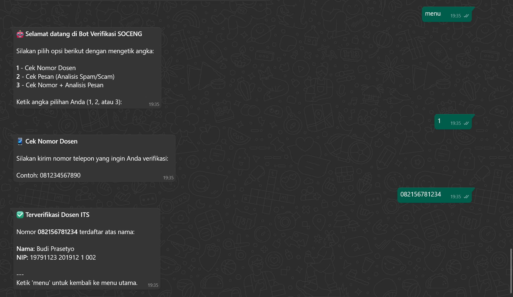
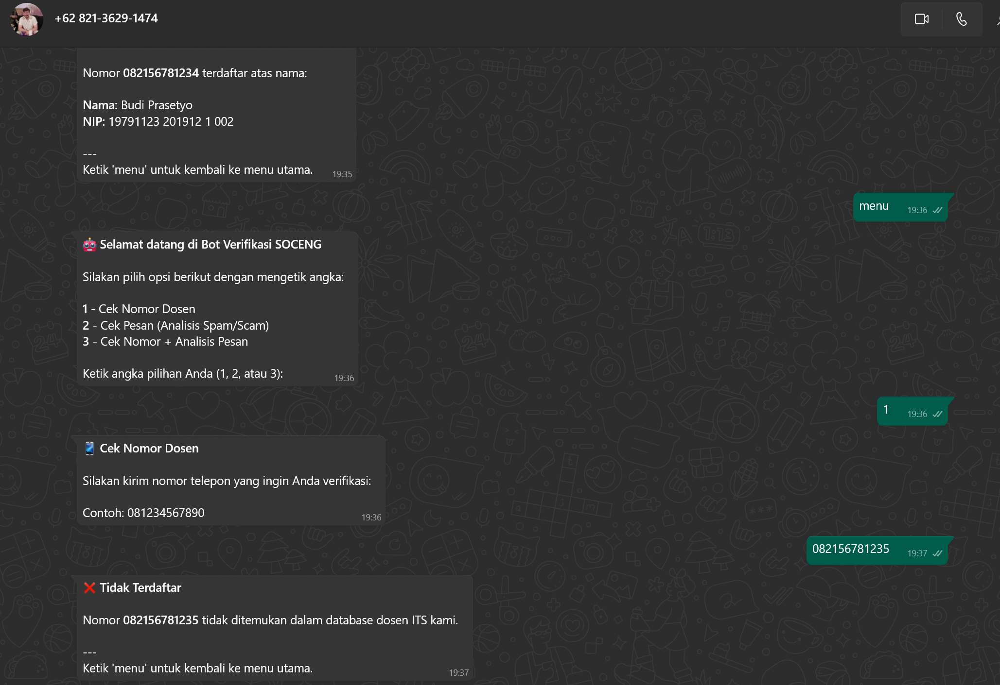
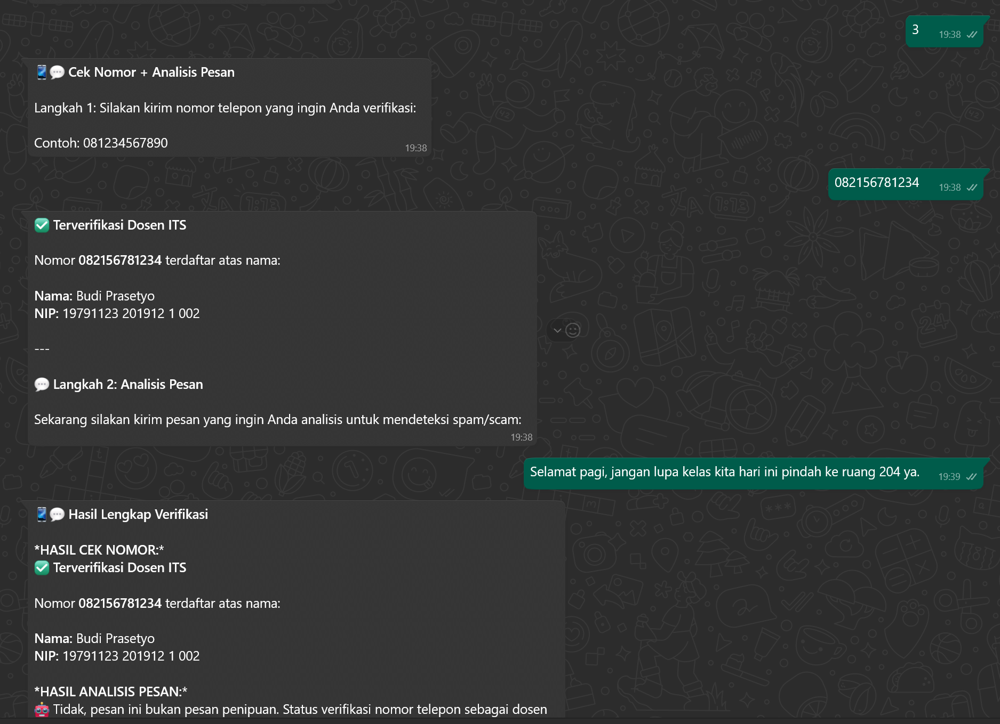

# **Bot WA Deteksi Pesan Penipuan**

Anggota Kelompok 14 SOC (Security Operations Center A)

- Daffa Rajendra Priyatama 5027231009
- Naufal Syafi' Hakim 5027231022
- RM. Novian Malcolm Bayuputra 5027231035
- Dzaky Faiq Fayyadhi 5027231047
- Dimas Andhika Diputra 5027231074

## **Preview**

### Cek pesan

Cek salah satu command cek pesan apakah scam atau bukan

### Cek nomor

Cek nomor dosen ditemukan:

Cek nomor dosen tidak ditemukan:

### Cek pesan + nomor

### Kontribusi Anggota Kelompok

#### Paper

Bab 1

- Daffa Rajendra Priyatama
- Naufal Syafi' Hakim
- Dimas Andhika Diputra

Bab 2

- RM. Novian Malcolm Bayuputra
- Dzaky Faiq Fayyadhi
- Daffa Rajendra Priyatama

Bab 3

- Naufal Syafi' Hakim
- RM. Novian Malcolm Bayuputra
- Dimas Andhika Diputra

Bab 4

- Dzaky Faiq Fayyadhi
- Daffa Rajendra Priyatama
- Naufal Syafi' Hakim

#### Kode

Konfigurasi, Struktur Data, dan Fungsi Database

- Daffa Rajendra Priyatama
- RM. Novian Malcolm Bayuputra
- Dzaky Faiq Fayyadhi

Inisialisasi WhatsApp Client dan Koneksi

- Naufal Syafi' Hakim
- Daffa Rajendra Priyatama
- Dimas Andhika Diputra

Pemrosesan Pesan dan Eksekusi Bot

- RM. Novian Malcolm Bayuputra
- Naufal Syafi' Hakim
- Dzaky Faiq Fayyadhi
- Dimas Andhika Diputra

Kontribusi 20% setiap anggota 
